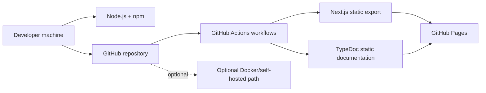

# Deployment Guide

## 1. Architecture overview

Цей проєкт є статичним Next.js App Router застосунком, який збирається у static export і публікується через GitHub Pages. Основний production-потік не використовує окремий app server, production database, cache server чи message broker.

Непридатні для цього проєкту класичні компоненти:

- production database: не використовується;
- cache server: не використовується;
- message broker / queue: не використовується;
- backend API layer: не використовується у санітизованій публічній версії.

## 2. Deployment model

Primary path:

- developer pushes changes to GitHub;
- GitHub Actions builds static export and documentation;
- artifact is published to GitHub Pages.

Secondary path:

- optional self-hosted/container experiments are possible, but not the primary supported deployment mode in this repository;
- Dockerfile exists in the repo, however current runtime configuration is optimized for static export via GitHub Pages.

## 3. Architecture diagram

## 4. Required hardware / resources

### Local development machine

- CPU: 2 cores or more
- RAM: 4 GB minimum, 8 GB recommended
- Disk: at least 1 GB free for source code, `node_modules`, builds, and generated docs

### Production hosting

- for GitHub Pages no dedicated VM/server resources are managed inside this repository;
- the practical requirement is an active GitHub repository with Pages and Actions enabled.

## 5. Required software

- Git
- Node.js 20.x
- npm 10+
- PowerShell 7+ for helper scripts in `docs/scripts/`
- optional Docker for non-primary local experiments

## 6. Network requirements

- outbound HTTPS access to `github.com`
- outbound HTTPS access to the npm registry during dependency installation
- local TCP port `3000` for development preview
- no inbound production port configuration is required for GitHub Pages

## 7. Server / configuration notes

- `next.config.mjs` uses `output: "export"`
- GitHub Pages deployment depends on correct `basePath` / `assetPrefix` handling in CI
- `siteConfig.url` should reflect the actual Pages URL
- GitHub repository settings should use `GitHub Actions` as the Pages source

### About Docker

Docker is not the primary deployment model here. If the Dockerfile is used in the future, it should be reviewed and aligned with the current static-export deployment strategy before treating it as a production-ready path.

## 8. Production deployment procedure

1. Merge tested changes into `main`.
2. Ensure `npm run check`, `npm run docs:build`, and `npm run build` pass locally or in CI.
3. Push `main` to GitHub.
4. Wait for the `Deploy to GitHub Pages` workflow to complete successfully.
5. Open the published Pages URL and verify that both landing page and generated docs are reachable.

## 9. Health verification

Після деплою перевір:

1. головну сторінку за production URL;
2. доступність `robots.txt` та `sitemap.xml`;
3. доступність generated docs path, наприклад `/docs/api/`;
4. відсутність помилок завантаження статичних asset-файлів у браузері;
5. коректну роботу мовного перемикача та внутрішніх посилань.
